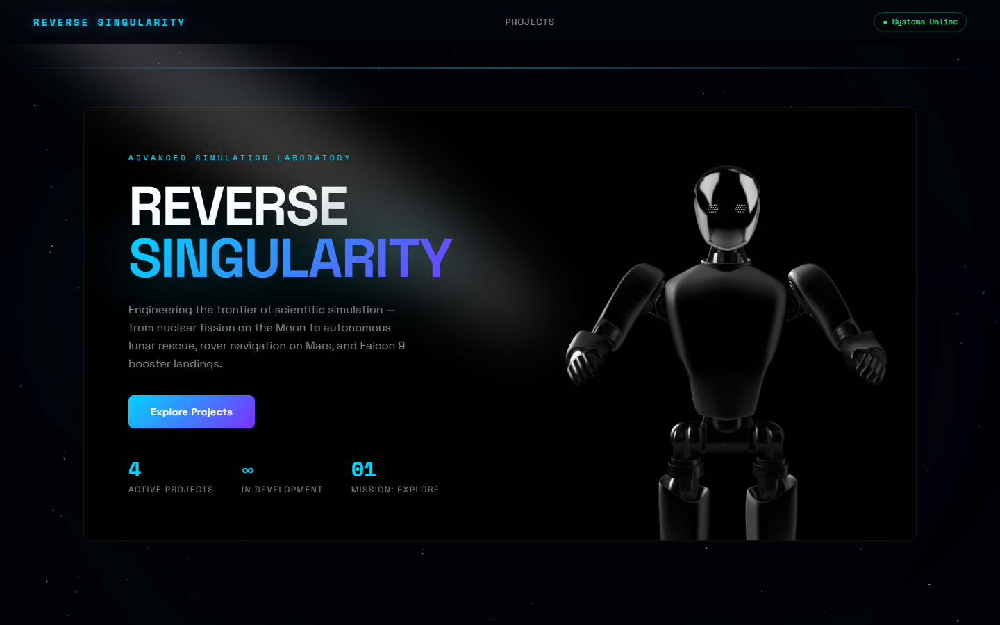
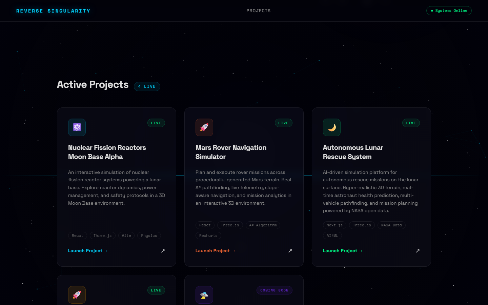

# Reverse Singularity — Landing Page

The marketing hub for [Reverse Singularity](https://reversesingularity.com): a collection of interactive scientific simulations spanning nuclear reactors, Mars rovers, lunar rescue systems, and rocket landing physics.

**Tagline:** Engineering the Frontier of Scientific Simulation

**Live site:** [reversesingularity.com](https://reversesingularity.com)  
**Repository:** [github.com/reversesingularity/reversesingularity_landing](https://github.com/reversesingularity/reversesingularity_landing)

---

## Screenshots

### Hero



### Projects grid



Screenshots captured from the production site at [reversesingularity.com](https://reversesingularity.com). To refresh them locally:

```bash
npx playwright install chromium
node scripts/capture-screenshots.mjs
```

---

## Features

- **Hero section** — Full-viewport intro with animated copy, Spline 3D scene, and spotlight effects
- **Projects grid** — Responsive card layout for live and upcoming simulations
- **Immersive backdrop** — Animated starfield canvas with scan-line overlay
- **Glassmorphism UI** — Dark-mode panels, accent glows, and gradient typography
- **Accessible motion** — Animations respect `prefers-reduced-motion`
- **Data-driven projects** — Add or update simulations by editing a single registry file

### Featured Projects

| Project | Status | Live app | GitHub |
|---------|--------|----------|--------|
| Nuclear Fission Reactors | Live | [nuclear.reversesingularity.com](https://nuclear.reversesingularity.com) | [nuclear-fission-reactors-moon-base-alpha](https://github.com/reversesingularity/nuclear-fission-reactors-moon-base-alpha) (private) |
| Mars Rover Navigation | Live | [rover.reversesingularity.com](https://rover.reversesingularity.com) | [mars-rover-navigation-simulator](https://github.com/reversesingularity/mars-rover-navigation-simulator) (private) |
| Autonomous Lunar Rescue System | Live | [alrs.reversesingularity.com](https://alrs.reversesingularity.com) | [autonomous-lunar-rescue-system](https://github.com/reversesingularity/autonomous-lunar-rescue-system) (private) |
| Falcon 9 Booster Landing | Live | [falcon9.reversesingularity.com](https://falcon9.reversesingularity.com) | [falcon9sim](https://github.com/reversesingularity/falcon9sim) |
| Autonomous Lunar Logistics | Live | [alls.reversesingularity.com](https://alls.reversesingularity.com) | [autonomous-lunar-logistics](https://github.com/reversesingularity/autonomous-lunar-logistics) |
| AI Exoplanet Discovery | Live | [exoplanet.reversesingularity.com](https://exoplanet.reversesingularity.com) | [exoplanet-spaceapp](https://github.com/reversesingularity/exoplanet-spaceapp) (private) |

---

## GitHub Repository Registry

All repositories under [github.com/reversesingularity](https://github.com/reversesingularity) are parsed into [`src/data/github-repos.ts`](src/data/github-repos.ts) (44 repos: 7 public, 37 private as of June 2026).

Regenerate after adding or renaming repos:

```bash
node scripts/sync-github-repos.mjs
```

### Landing page ↔ repository mapping

| Landing card (`projects.ts`) | Primary repository | Visibility |
|------------------------------|-------------------|------------|
| `nuclear` | [nuclear-fission-reactors-moon-base-alpha](https://github.com/reversesingularity/nuclear-fission-reactors-moon-base-alpha) | Private |
| `rover` | [mars-rover-navigation-simulator](https://github.com/reversesingularity/mars-rover-navigation-simulator) | Private |
| `alrs` | [autonomous-lunar-rescue-system](https://github.com/reversesingularity/autonomous-lunar-rescue-system) | Private |
| `falcon9` | [falcon9sim](https://github.com/reversesingularity/falcon9sim) | Public |
| `alls` | [autonomous-lunar-logistics](https://github.com/reversesingularity/autonomous-lunar-logistics) | Public |
| `exoplanet` | [exoplanet-spaceapp](https://github.com/reversesingularity/exoplanet-spaceapp) | Private |

Related public repos: [luna-40-nasa-reactor](https://github.com/reversesingularity/luna-40-nasa-reactor) (NASA Challenge submission, also deployed at nuclear subdomain).

### Other live deployments

| Repository | Live URL | Visibility |
|------------|----------|------------|
| [autonomous-lunar-logistics](https://github.com/reversesingularity/autonomous-lunar-logistics) | [alls.reversesingularity.com](https://alls.reversesingularity.com) | Public |
| [exoplanet-spaceapp](https://github.com/reversesingularity/exoplanet-spaceapp) | [exoplanet.reversesingularity.com](https://exoplanet.reversesingularity.com) | Private |
| [phobetron_web_app](https://github.com/reversesingularity/phobetron_web_app) | [phobetronwebapp-production-d69a.up.railway.app](https://phobetronwebapp-production-d69a.up.railway.app) | Public |
| [stone-sceptre-website](https://github.com/reversesingularity/stone-sceptre-website) | [reversesingularity.github.io/stone-sceptre-website](https://reversesingularity.github.io/stone-sceptre-website/) | Public |
| [feast-planner](https://github.com/reversesingularity/feast-planner) | [feast-planner.vercel.app](https://feast-planner.vercel.app) | Private |
| [luna-40-nasa-reactor](https://github.com/reversesingularity/luna-40-nasa-reactor) | [luna-40-nasa-reactor.vercel.app](https://luna-40-nasa-reactor.vercel.app) | Public |

### Repositories by category

| Category | Count | Examples |
|----------|------:|----------|
| ML / AI | 13 | `phobetron_web_app`, `second-brain`, `automated-audiobook-production-and-distribution-pipeline` |
| Simulation | 12 | `falcon9sim`, `mars-rover-navigation-simulator`, `autonomous-lunar-rescue-system`, `exoplanet-spaceapp` |
| Web apps | 8 | `stone-sceptre-website`, `feast-planner`, `beyond-the-plate-web-app` |
| Maps / geospatial | 7 | `multi-agent-battle-map`, `interactive-historical-map-generator`, `country-maps` |
| Games | 3 | `CydonianSoulsvania`, `CydonianOaths`, `rts-game-dev` |
| Other | 1 | — |

See [`src/data/github-repos.ts`](src/data/github-repos.ts) for the full machine-readable catalog with descriptions, languages, and update timestamps.


## Tech Stack

| Layer | Tools |
|-------|-------|
| Framework | React 18, TypeScript |
| Build | Vite 5 |
| Styling | Tailwind CSS 3 |
| Animation | Motion for React (v12) |
| 3D | Spline (`@splinetool/react-spline`) |
| Deploy | Vercel |

---

## Getting Started

### Prerequisites

- [Node.js](https://nodejs.org/) 18 or later
- npm (included with Node.js)

### Install

```bash
git clone https://github.com/reversesingularity/reversesingularity_landing.git
cd reversesingularity_landing
npm install
```

### Development

```bash
npm run dev
```

Open [http://localhost:5173](http://localhost:5173) in your browser. Vite hot-reloads on file changes.

### Production Build

```bash
npm run build
```

TypeScript is checked first, then Vite outputs static assets to `dist/`.

### Preview Production Build

```bash
npm run preview
```

Serves the `dist/` folder locally for a final check before deploy.

---

## Project Structure

```
reversesingularity_landing/
├── design-system/
│   └── MASTER.md              # Brand, color, typography, and motion tokens
├── docs/
│   ├── ADDING-A-PROJECT.md    # Full add-project playbook
│   └── screenshots/           # README preview images
├── .cursor/
│   ├── rules/                 # Cursor rules (registry + deploy)
│   └── skills/add-landing-project/  # Agent skill for new projects
├── scripts/
│   ├── capture-screenshots.mjs
│   ├── scaffold-project.mjs   # Generate registry entry template
│   ├── sync-github-repos.mjs
│   └── validate-projects.mjs  # Lint projects.ts
├── src/
│   ├── components/
│   │   ├── layout/            # Navbar, Footer
│   │   ├── sections/          # Hero, ProjectsGrid
│   │   └── ui/                # Button, Badge, Card, StarfieldCanvas, Spline, Spotlight
│   ├── data/
│   │   ├── projects.ts        # Project registry (add new cards here)
│   │   └── github-repos.ts    # Auto-generated GitHub catalog
│   ├── lib/
│   │   ├── motionVariants.ts  # Shared animation variants
│   │   └── utils.ts           # Tailwind class merge helpers
│   ├── styles/
│   │   └── index.css          # CSS custom properties + Tailwind base
│   ├── App.tsx
│   └── main.tsx
├── index.html
├── tailwind.config.js
├── vite.config.ts
└── vercel.json
```

Path alias: `@/` resolves to `src/` (configured in `vite.config.ts`).

---

## Adding a Project

**Full playbook:** [`docs/ADDING-A-PROJECT.md`](docs/ADDING-A-PROJECT.md)  
**Cursor automation:** [`AGENTS.md`](AGENTS.md) + skill `.cursor/skills/add-landing-project/`

Quick start:

```bash
node scripts/scaffold-project.mjs --id my-project --title "Project Name" --repo my-repo --slug my-project
# Paste output into src/data/projects.ts (before the `future` entry)
npm run validate:projects && npm run build
vercel --prod --yes
```

Minimal registry entry:

```ts
{
  id: 'my-project',
  title: 'Project Name',
  subtitle: 'Optional subtitle',
  description: 'One paragraph describing the project.',
  icon: '🛸',
  accent: 'cyan',           // 'cyan' | 'orange' | 'green' | 'amber' | 'purple'
  tags: ['React', 'Three.js'],
  url: 'https://my-project.reversesingularity.com',
  repoUrl: 'https://github.com/reversesingularity/my-repo',
  status: 'live',
}
```

Also update `LIVE_URLS` and `LANDING_REPO_MAP` in `scripts/sync-github-repos.mjs`, then run `npm run sync:repos`. The grid and Hero live count update automatically — no component changes required.

---

## Design System

Visual and interaction guidelines live in [`design-system/MASTER.md`](design-system/MASTER.md). It covers:

- Brand identity and tone
- Color tokens and contrast requirements
- Typography (Space Grotesk + Space Mono)
- Glassmorphism panel recipes
- Motion durations, easing, and reduced-motion rules
- Per-project accent color mapping

---

## Deployment

The site is configured for [Vercel](https://vercel.com):

- **Production URL:** [reversesingularity.com](https://reversesingularity.com)
- **Vercel URL:** [reversesingularitylanding.vercel.app](https://reversesingularitylanding.vercel.app)
- **Build command:** `npm run build`
- **Output directory:** `dist`
- **SPA routing:** All paths rewrite to `index.html` (see `vercel.json`)

Connect the repository in Vercel and deploy — no extra configuration needed.

---

## Scripts

| Command | Description |
|---------|-------------|
| `npm run dev` | Start Vite dev server |
| `npm run build` | Type-check and build for production |
| `npm run preview` | Serve the production build locally |
| `npm run validate:projects` | Lint `src/data/projects.ts` registry |
| `npm run sync:repos` | Regenerate `github-repos.ts` from GitHub |
| `npm run scaffold:project` | Print template for a new project entry |

---

## License

Copyright © 2026 Reverse Singularity. All rights reserved.

This repository and its source code are proprietary. No open-source license is currently declared for this project. You may not copy, modify, distribute, or use the code without explicit written permission from Reverse Singularity.

The **Reverse Singularity** name, branding, and associated simulation projects are owned by Reverse Singularity.

Third-party dependencies retain their respective licenses (see `package-lock.json`).

If you would like to contribute or reuse this code, please contact the project maintainers.
